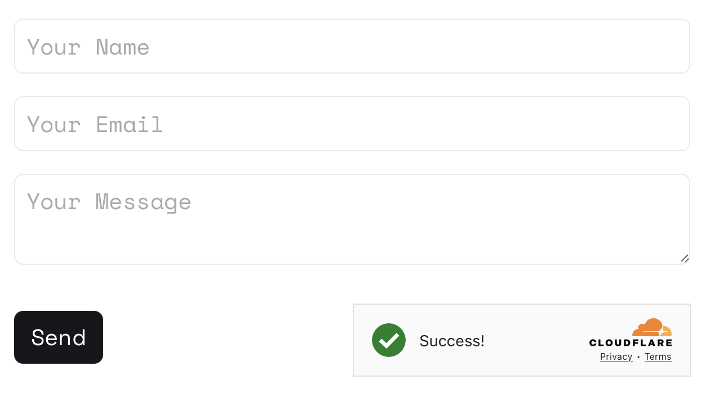
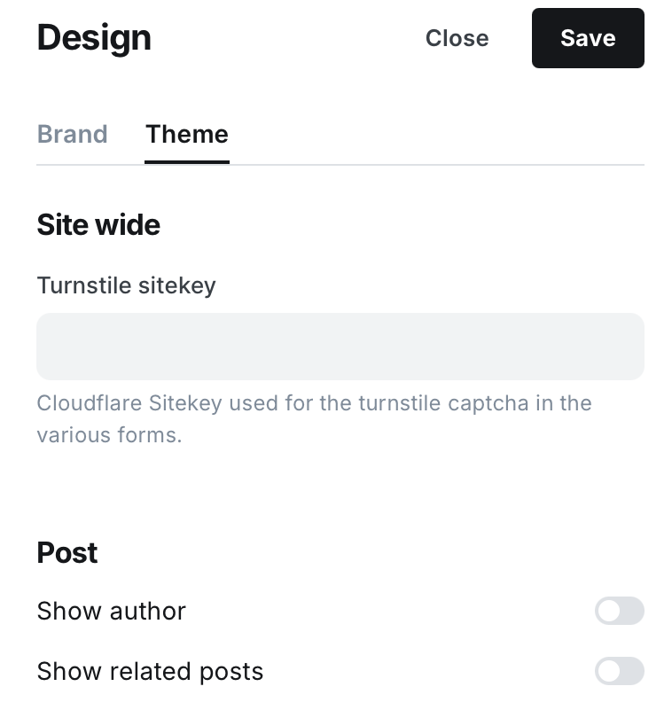

# Dope

A unique **featured-post**-based [Ghost](https://github.com/TryGhost/Ghost) theme to arrange your publications into collections. Keep organized and let your readers explore your publications with beautifully designed tag columns.

**Demo: https://dope.ghost.io**

# Instructions

1. Zip up this current forked version of the `Dope` theme
2. Log into Ghost, and go to the `Design` settings area to upload the zip file

This variant uses featured posts to promote to the home page. Also, I have removed the date/timestamp for featured articles as they will probably seem a bit ... old.

## MJelks Deviations from the Norm

1. `index.hbs`
   1. instead of using `tags`, I am filtering on **Featured** Posts
2. `partials/contact-form.hbs`
   - I have created a new partial that is using a bespoke javascript that talks to an express / node.js backend with a SendGrid API
    - 
   - To invoke / use this, simply tag any post with a **#contact** (internal tag)
      - (if you don't have the tag, just make it)
3. I have created a spot to add the Cloudflare Sitekey needed for the Captcha/Spam protection.
   - visit `/ghost/#/settings/design/edit`
   - 

# Development

Styles are compiled using Gulp/PostCSS to polyfill future CSS spec. You'll need [Node](https://nodejs.org/), [Yarn](https://yarnpkg.com/) and [Gulp](https://gulpjs.com) installed globally. After that, from the theme's root directory:

```bash
# Install
yarn

# Run build & watch for changes
yarn dev
```

Now you can edit `/assets/css/` files, which will be compiled to `/assets/built/` automatically.

The `zip` Gulp task packages the theme files into `dist/dope.zip`, which you can then upload to your site.

```bash
yarn zip
```

# Contribution

This repo is synced automatically with [TryGhost/Themes](https://github.com/TryGhost/Themes) monorepo. If you're looking to contribute or raise an issue, head over to the main repository [TryGhost/Themes](https://github.com/TryGhost/Themes) where our official themes are developed.

# Copyright & License

Copyright (c) 2013-2025 Ghost Foundation - Released under the [MIT license](LICENSE).
